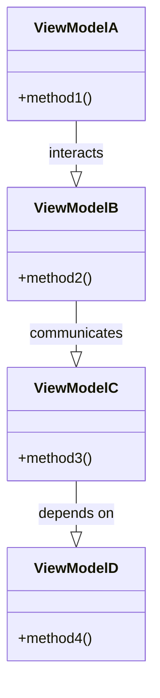

```mermaid
classDiagram
    class ViewModelA {
        +method1()
    }
    class ViewModelB {
        +method2()
    }
    class ViewModelC {
        +method3()
    }
    class ViewModelD {
        +method4()
    }
    ViewModelA --|> ViewModelB : interacts
    ViewModelB --|> ViewModelC : communicates
    ViewModelC --|> ViewModelD : depends on
```
